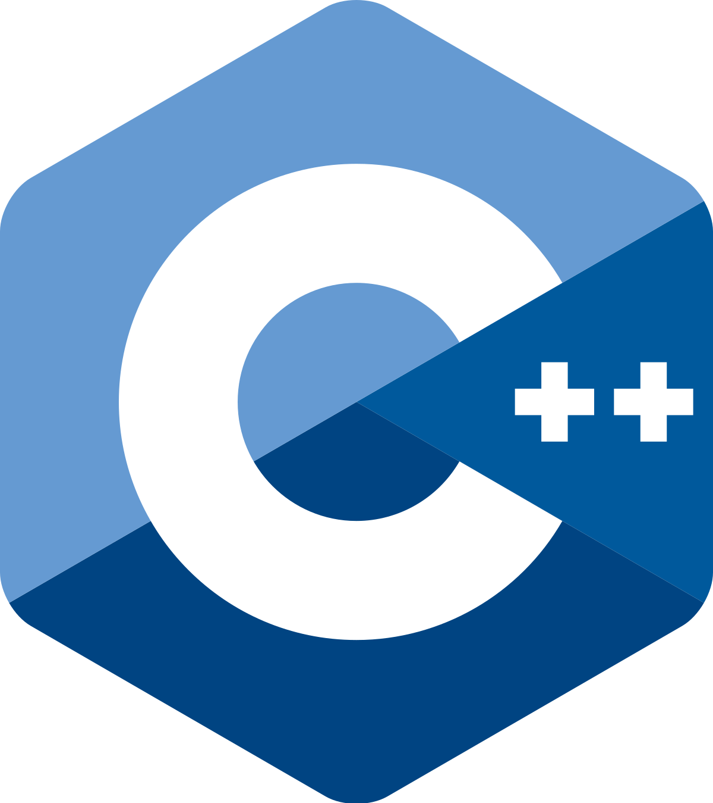

<h1 align="center">EncephalonPrime</h1>

  

    <strong>A complete authoral library to create fully-connected neural networks.</strong>
  

  

    
  

## ⚠️ This project is currently in development ⚠️
Some features may not be available at the moment.

## Description
Made with C++. EncephalonPrime is a library that helps to create variable-sized FCNN. There's multiple activation functions implemented (ReLU, Sigmoid, etc), a save/load system, Adam for better training, Kaiming initialization and much more!

## Author

| [ @rafafelps](https://github.com/rafafelps)  |
| :---: |
